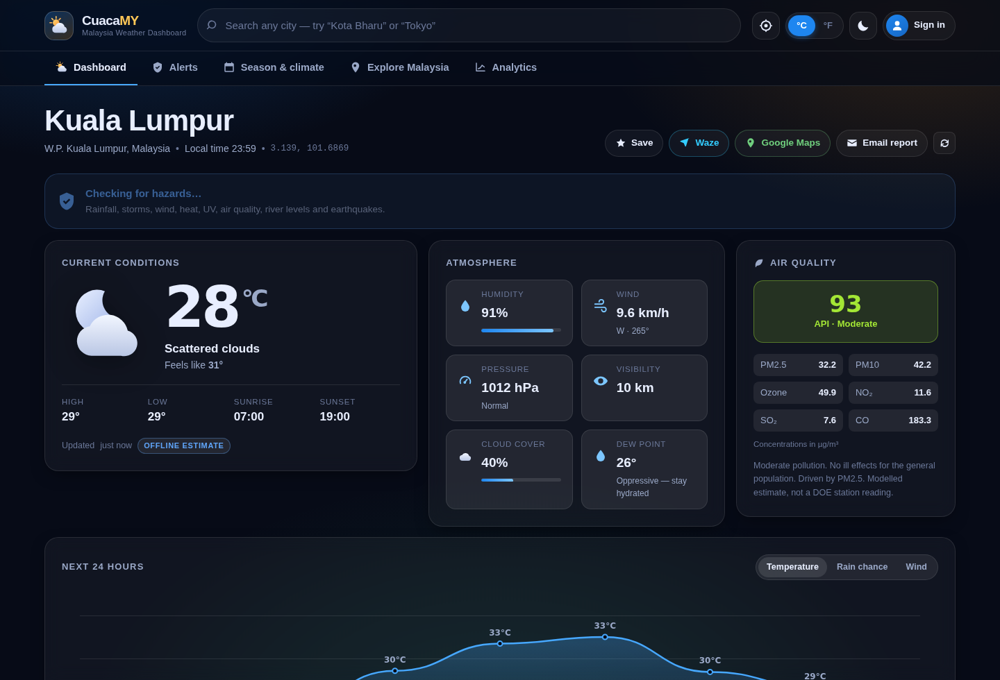
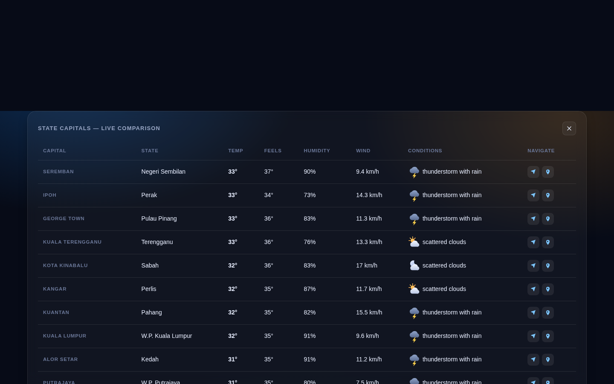
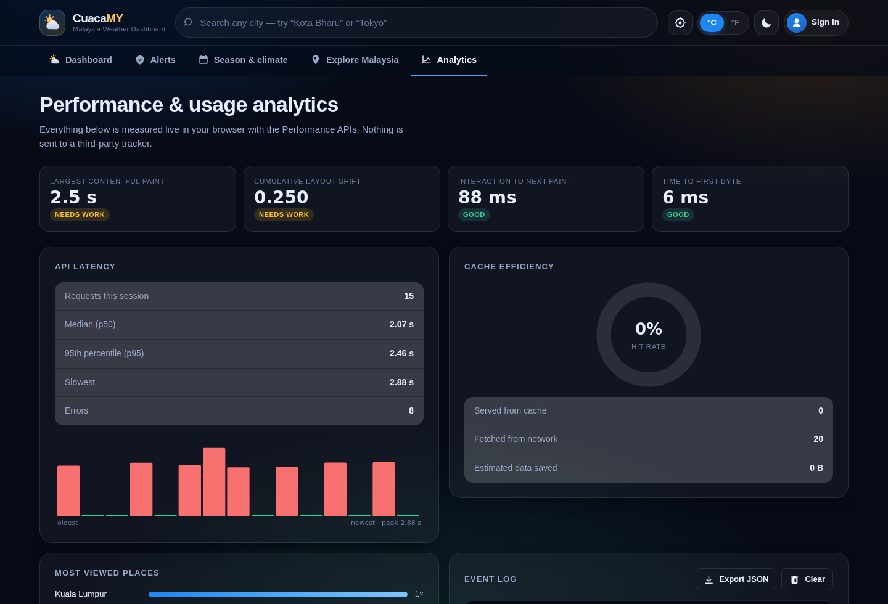
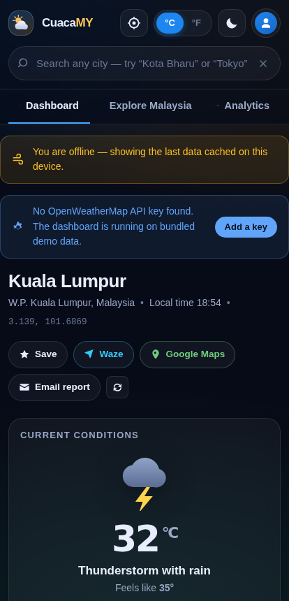

<div align="center">


# CuacaMY — Malaysia Weather Dashboard

**A production-grade weather dashboard built with nothing but HTML, CSS and JavaScript.**
No framework. No bundler. No `node_modules`. No build step.

*Cuaca* is Malay for *weather*.

[](https://github.com/ZanOzair/cuacamy-weather-dashboard/actions/workflows/ci.yml)
[](https://github.com/ZanOzair/cuacamy-weather-dashboard/actions/workflows/pages.yml)
[](LICENSE)


</div>



---

## What it does

A weather dashboard for Malaysia that behaves like a real product, not a tutorial exercise.

| | |
|---|---|
| **Search anywhere** | Instant autocomplete over **206 Malaysian towns across all 16 states and federal territories**, bundled into the app — plus worldwide geocoding through OpenWeatherMap. |
| **Current conditions** | Temperature, feels-like, humidity, wind speed and bearing, pressure, visibility, cloud cover, computed dew point and a plain-English comfort reading. |
| **5-day forecast** | Clean cards with high/low, dominant condition, rain probability and a relative temperature-range bar. Tap any day for its 3-hourly breakdown. |
| **Next 24 hours** | A smoothed Canvas chart you can switch between temperature, rain chance and wind. |
| **Air quality** | Live AQI with PM2.5, PM10, ozone, NO₂, SO₂ and CO, plus guidance on what the number means for you. |
| **Navigation** | One-tap **Waze** and **Google Maps** deep links that hand off to the native app on mobile. |
| **Find me** | Geolocation with reverse geocoding, falling back to the nearest bundled Malaysian town when offline. |
| **Accounts** | Sign up, sign in and sign out — locally with WebCrypto, or through Firebase with Google sign-in. |
| **Sync** | Saved places and preferences persist in IndexedDB and mirror to Cloud Firestore when signed in. |
| **Analytics** | A live Core Web Vitals dashboard, API latency percentiles, cache hit rate and a personal usage chart — all measured in-browser, none of it sent anywhere. |
| **Offline** | Full PWA: installable, service-worker cached, and usable in aeroplane mode. |
| **Email** | Generates a formatted briefing and opens it as a prefilled Gmail draft (or `mailto:`), copied to the clipboard as well. |

---

## Live demo

**→ https://zanozair.github.io/cuacamy-weather-dashboard/**

The demo runs without an API key. Rather than showing an empty shell, it generates
deterministic tropical weather from a seeded PRNG, so every feature — charts, forecast,
air quality, analytics — is fully explorable. A `DEMO DATA` badge always tells you when
you are looking at synthetic values.

### More screens

| Explore Malaysia | Performance analytics |
|---|---|
|  |  |

<div align="center"></div>

---

## Run it locally

The app is an ES module, so it needs to be served over HTTP — opening `index.html`
straight off disk will be blocked by the browser's CORS rules.

```bash
git clone https://github.com/ZanOzair/cuacamy-weather-dashboard.git
cd cuacamy-weather-dashboard

# any static server works — pick one
python3 -m http.server 8000
npx serve .
php -S localhost:8000
```

Then open <http://localhost:8000>. That is the entire setup.

### Adding live weather data

1. Get a free key at [openweathermap.org/api](https://openweathermap.org/api).
2. Either paste it into the in-app **Settings** dialog (stored in your browser only,
   never committed), **or** put it in `config.js`:

```js
export default {
  openWeatherKey: 'your-key-here',
  firebase: null,
  googleMapsKey: ''
};
```

> **New keys take up to two hours to activate.** A `401` right after signing up is
> normal — wait, then try again.

Only free-tier endpoints are used, so a brand-new account is enough:
`/data/2.5/weather`, `/data/2.5/forecast`, `/data/2.5/air_pollution`,
`/geo/1.0/direct` and `/geo/1.0/reverse`.

### Enabling real accounts and cloud sync (optional)

Without configuration the app uses **local accounts**. Supply a Firebase config in
`config.js` and it switches to **Firebase Authentication** (email/password *and*
Google sign-in) with saved places synced to Cloud Firestore. Nothing else changes —
both back ends sit behind one interface.

<details>
<summary><strong>Firebase setup, step by step</strong></summary>

1. Create a project at [console.firebase.google.com](https://console.firebase.google.com).
2. **Build → Authentication → Sign-in method**: enable *Email/Password* and *Google*.
3. **Build → Firestore Database**: create a database.
4. **Project settings → Your apps → Web**: copy the config object into `config.js`.
5. **Authentication → Settings → Authorized domains**: add the domain you deploy to.
6. Lock Firestore down so users can only touch their own document:

```js
rules_version = '2';
service cloud.firestore {
  match /databases/{database}/documents {
    match /users/{uid} {
      allow read, write: if request.auth != null && request.auth.uid == uid;
    }
  }
}
```

The Firebase web config is **not** a secret — it identifies your project, it does not
authorise anything. Your actual security boundary is the Authorized Domains list plus
the rules above.

</details>

---

## Deployment

Two workflows, deliberately separate:

- [`ci.yml`](.github/workflows/ci.yml) — runs on every push and pull request. Syntax-checks
  the JavaScript, validates the manifest, verifies every asset referenced by `index.html`
  and the manifest actually exists, and warns if an API key has been committed. This is
  what the build badge tracks.
- [`pages.yml`](.github/workflows/pages.yml) — publishes to GitHub Pages on every push to
  `main`, then verifies the deployed site over the network.

`pages.yml` publishes by pushing the site to the `gh-pages` branch, then a second job
fetches the live URL and fails the build unless it returns `200`, contains the app, and
serves `app.js`, `style.css`, the manifest, the service worker and an icon. Deployment is
therefore proven on every push, not assumed.

<details>
<summary><strong>Why push a branch instead of using <code>actions/deploy-pages</code>?</strong></summary>

`actions/deploy-pages` publishes through the `github-pages` environment. When Pages is
served from a branch, that environment admits only the branch it serves, so a run
triggered from `main` is rejected before it starts:

```
Branch "main" is not allowed to deploy to github-pages
due to environment protection rules.
```

Two neighbouring approaches fail for their own reasons, and both are worth knowing:

- A repository's `GITHUB_TOKEN` may not *create* a Pages site — the API answers
  `Resource not accessible by integration` — so `actions/configure-pages` with
  `enablement: true` cannot bootstrap Pages on a fresh repo.
- The publish step deliberately excludes `.github/` from the copied tree. A
  `GITHUB_TOKEN` push is refused outright if it would add or modify anything under
  `.github/workflows`, which would otherwise break the job on every run.

Pushing the branch touches none of that machinery, so it works regardless of how Pages
was switched on.

</details>

Because it is pure static files, it also drops onto Netlify, Vercel, Cloudflare Pages or
any web server unchanged — no configuration, no build command.

**One header worth adding** where your host allows it — browsers ignore `frame-ancestors`
in a `<meta>` CSP, so clickjacking protection has to come from a response header:

```
Content-Security-Policy: frame-ancestors 'none'
```

---

## How it is built

```
cuacamy-weather-dashboard/
├── index.html          Semantic markup, ARIA wiring, inline SVG icon sprite
├── style.css           Design tokens, dark + light themes, responsive grid
├── app.js              The whole application, in 24 documented sections
├── sw.js               Service worker — two caching strategies
├── config.js           Blank by default; your keys go here
├── config.example.js   Annotated configuration template
├── manifest.webmanifest
├── .nojekyll           Serve files verbatim, no Jekyll preprocessing
└── assets/             Generated PNG icons, favicon, social preview
```

Three files hold the app itself, exactly as the brief for this project required.
`app.js` is organised as numbered sections rather than split into modules, so it can be
read top to bottom:

| § | Section | § | Section |
|---|---|---|---|
| 01 | Configuration & constants | 13 | Charts |
| 02 | Malaysia gazetteer | 14 | Saved places |
| 03 | Utilities | 15 | Explore Malaysia |
| 04 | Telemetry | 16 | Analytics view |
| 05 | **HTTP layer** | 17 | Search combobox |
| 06 | OpenWeatherMap client | 18 | Geolocation & sharing |
| 07 | Icon mapping | 19 | Views |
| 08 | Persistence | 20 | Auth UI |
| 09 | Authentication | 21 | Settings |
| 10 | Application state | 22 | Event wiring |
| 11 | Data orchestration | 23 | Service worker |
| 12 | Dashboard rendering | 24 | Boot |

### The network layer

Section 05 is the heart of the project and is commented line by line, because `fetch`
has two behaviours that catch people out:

```js
const response = await fetch(url);
// 1. This resolves for 404 and 500 too. fetch only REJECTS on a genuine
//    network failure — DNS, TLS, offline, CORS. You must check response.ok.
// 2. The body has not downloaded yet. Reading it is a second async step.
const data = await response.json();
```

On top of that, four things a real dashboard needs and `fetch` does not provide:

- **Timeouts** — `fetch` has no timeout option, so an `AbortController` is armed with a
  `setTimeout` and torn down in a `finally` block.
- **Retry with backoff** — only for failures that could plausibly succeed on a retry
  (network errors, `5xx`, `429`). A `401` or `404` is a permanent answer; retrying it
  just burns the user's API quota.
- **In-flight de-duplication** — six cards asking for one URL make one request and share
  one Promise.
- **Stale-while-revalidate** — cached data paints instantly, then refreshes behind the
  user's back. Errors during revalidation are swallowed, because there is already
  usable data on screen.

### Performance

| Decision | Effect |
|---|---|
| Zero runtime dependencies | ~120 KB of source total; no framework parse cost |
| Bundled gazetteer, packed as a delimited string | Malaysian search resolves with **no network request**, ~60% smaller than JSON objects |
| Two-tier cache (Map + `localStorage`) with per-endpoint TTLs | Repeat views paint from memory |
| `Promise.allSettled` for the three API calls | Air quality failing never blanks the temperature |
| Batched concurrency (4 at a time) for the 16-capital comparison | Stays under rate limits and the browser's connection cap |
| Service worker: cache-first shell, network-first data | Instant repeat loads; works offline |
| Canvas charts backed by `devicePixelRatio` | Crisp on retina without a charting library |
| `requestAnimationFrame`-throttled resize, debounced search | No layout thrash, no request storms |
| Icons as one inline SVG sprite | Zero image requests |

The Analytics tab measures all of this live via `PerformanceObserver` — LCP, CLS, INP
and TTFB, graded against Google's published thresholds.

### Accessibility

- Search implements the full WAI-ARIA 1.2 combobox pattern: `aria-expanded`,
  `aria-activedescendant`, roving selection, arrow/enter/escape keys.
- Tabs are a real `tablist` with arrow-key navigation.
- Every icon is `aria-hidden`; every icon-only control has an accessible label.
- The hourly chart, which is pixels, publishes a text summary for screen readers.
- Visible focus rings throughout, a skip link, and `prefers-reduced-motion` honoured
  alongside an in-app reduce-motion switch.
- Both themes were checked for contrast; the light theme redefines every token rather
  than patching a few.

### Security

- **No `innerHTML` anywhere.** All text goes through `textContent` and a small `el()`
  helper, so nothing from the API or the search box can inject markup.
- A strict **Content Security Policy** with no `unsafe-inline`. Dynamic styling uses
  CSSOM (`element.style.setProperty`), which CSP permits, rather than `style` attributes,
  which it blocks.
- Local passwords are stretched with **PBKDF2-SHA256, 210,000 iterations** and a random
  per-user salt via WebCrypto; only the derived hash is stored. Sign-in derives a hash
  even for unknown accounts so timing cannot reveal which emails exist.
- External links carry `rel="noopener noreferrer"`.
- Every `localStorage` access is wrapped — Safari private mode disables it outright.

> **On local accounts, honestly:** browser-side authentication is a convenience feature,
> not a security boundary. Anything in a browser database is readable by whoever holds
> the device, and a static site has no server to verify anything. It is the right choice
> for a zero-backend deployment and it is implemented carefully — but for real account
> security, configure Firebase, which is exactly why that path exists.

---

## Keyboard shortcuts

| Key | Action |
|---|---|
| <kbd>/</kbd> or <kbd>Ctrl</kbd>/<kbd>⌘</kbd> + <kbd>K</kbd> | Focus search |
| <kbd>↑</kbd> <kbd>↓</kbd> | Move through suggestions |
| <kbd>Enter</kbd> | Select |
| <kbd>Esc</kbd> | Close suggestions or dialog |
| <kbd>←</kbd> <kbd>→</kbd> | Switch tabs (when a tab is focused) |
| <kbd>Ctrl</kbd>/<kbd>⌘</kbd> + <kbd>,</kbd> | Settings |

---

## Browser support

Chrome/Edge 90+, Firefox 90+, Safari 15.4+. Requires ES modules, `dialog`,
CSS custom properties, `IndexedDB` and `crypto.subtle`. Features that are not universally
available — `PerformanceObserver` entry types, service workers, geolocation — are each
feature-detected and degrade quietly.

## Data & credits

Weather, geocoding and air quality from [OpenWeatherMap](https://openweathermap.org/).
Place coordinates compiled by hand for this project. Weather icons, UI icons, app icons
and the social preview were all authored for this repository — no icon library.

## License

[MIT](LICENSE) © Mohamad Hamizan ([@ZanOzair](https://github.com/ZanOzair))
