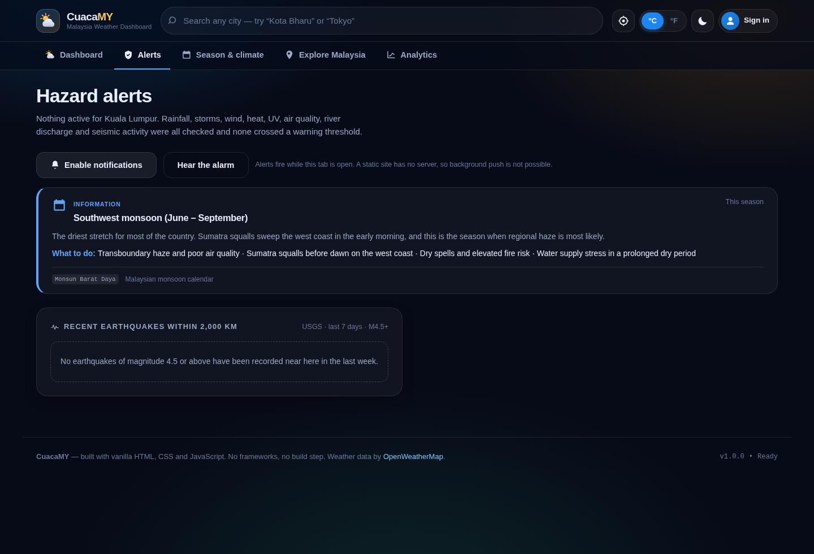
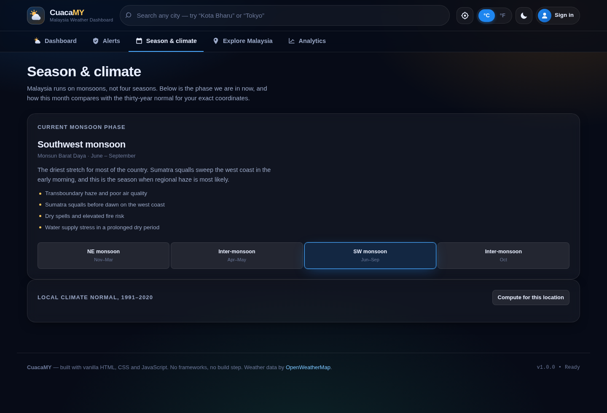

<div align="center">


# CuacaMY — Malaysia Weather Dashboard

**A production-grade weather and hazard dashboard built with nothing but HTML, CSS and JavaScript.**
No framework. No bundler. No `node_modules`. No build step. **No API key needed.**

*Cuaca* is Malay for *weather*.

[](https://github.com/ZanOzair/cuacamy-weather-dashboard/actions/workflows/ci.yml)
[](https://github.com/ZanOzair/cuacamy-weather-dashboard/actions/workflows/pages.yml)
[](LICENSE)


</div>


---

## Contents

**Using CuacaMY** — you need nothing but a browser
[What it is](#what-it-is) ·
[Try it now](#try-it-now) ·
[**Installation**](#installation) ·
[**How to use it, A to Z**](#how-to-use-it-a-to-z) ·
[Screens](#more-screens) ·
[Troubleshooting](#troubleshooting)

**Running it yourself** — only if you want your own copy
[For the site owner](#for-the-site-owner) ·
[Running your own copy](#running-your-own-copy) ·
[Deployment](#deployment) ·
[How it is built](#how-it-is-built) ·
[Testing](#testing)

---

## What it is

CuacaMY is a **free weather app for Malaysia**. It shows the weather where you are right
now, warns you about floods, storms, haze and earthquakes near you, and tells you which
government agency to call when something goes wrong.

It works in any web browser, and you can **install it on your phone like a normal app**.
There is nothing to buy, no account needed to use it, and no advertising.

| | |
|---|---|
| **Free, no sign-up** | Open the link and it works. An account is optional and only saves your favourite places. |
| **Works offline** | Once installed it keeps showing your last readings with no signal. |
| **Covers all of Malaysia** | 206 towns across all 13 states and 3 federal territories. |
| **Warns you early** | Heavy rain, thunderstorms, strong wind, heat, UV, haze, river flooding and earthquakes. |
| **Tells you who to call** | 17 official agencies with phone numbers and report links. |
| **Small** | About 1 MB. Loads in under a second. |

---

## Try it now

**→ https://zanozair.github.io/cuacamy-weather-dashboard/**

No key, no sign-up, no advertising. Real live data from Open-Meteo, which permits browser
requests without registration.

If every provider is unreachable — you are offline, or an API is down — the app falls back
to a deterministic synthetic model rather than showing an empty shell, and labels it
`Offline estimate` so you always know what you are looking at.

---

## Installation

CuacaMY installs **from your browser**, not from an app store. There is no `.apk` to
sideload and no App Store listing — the website *becomes* the app. Pick your device below.

### 📱 Android — Chrome, Samsung Internet, Edge, Opera

1. Open **https://zanozair.github.io/cuacamy-weather-dashboard/**
2. Tap the **Install app** button at the top of the page
   *(or the **⋮** menu → **Install app** / **Add to Home screen**)*
3. Tap **Install** to confirm

CuacaMY now sits with your other apps and opens full screen.

### 🍎 iPhone and iPad — Safari **only**

1. Open **https://zanozair.github.io/cuacamy-weather-dashboard/** in **Safari**
2. Tap the **Share** button at the bottom — the square with an arrow pointing up
3. Scroll down and tap **Add to Home Screen**
4. Tap **Add** in the top-right corner

> **Why Safari?** Apple does not let Chrome or Firefox on iOS add apps to the home screen.
> That is an Apple restriction, not a limitation of CuacaMY. Open the link in Safari first.

### 💻 Windows, Mac and Linux — Chrome, Edge, Brave

1. Open **https://zanozair.github.io/cuacamy-weather-dashboard/**
2. Click the **install icon** at the right-hand end of the address bar — a small screen
   with a downward arrow
3. Click **Install**

No icon in the address bar? Use the browser menu:
**Chrome** → *Cast, save and share* → *Install page as app*.
**Edge** → *Apps* → *Install this site as an app*.

CuacaMY opens in its own window and appears in your Start menu, Dock or Applications folder.

### 🦊 Firefox

Firefox **on a computer** cannot install web apps — but everything still works normally in
the browser, including offline use. Firefox **on Android** can: **⋮** menu →
**Add to Home screen**.

### 📦 Download the source

Prefer to keep a copy or run it yourself?

- **[Download ZIP](https://github.com/ZanOzair/cuacamy-weather-dashboard/archive/refs/heads/main.zip)** — the whole app, about 1 MB
- Or clone it: `git clone https://github.com/ZanOzair/cuacamy-weather-dashboard.git`

See [Running your own copy](#running-your-own-copy) below.

### To remove it

Delete the icon like any other app. Nothing is left behind on your device.

---

## How to use it, A to Z

Everything below works immediately, with no account and no setup.

### A · Open it

Go to **https://zanozair.github.io/cuacamy-weather-dashboard/**. The weather for Kuala
Lumpur loads straight away.

### B · Let it find you

A small bar appears asking to use your location. Tap **Use my location** and allow it in
your browser. CuacaMY then shows the weather and any hazards for exactly where you are.

Prefer not to share your location? Ignore the bar and use the search box instead — nothing
is lost except the automatic part.

### C · Search for any place

Type into the search box at the top. Start typing `Kota Bh` and **Kota Bharu** appears.
All 206 Malaysian towns are built into the app, so this works instantly and even offline.
Cities outside Malaysia work too.

Use <kbd>↑</kbd> <kbd>↓</kbd> to move through the list and <kbd>Enter</kbd> to choose.

### D · Read the current weather

The big card shows the temperature now, what it *feels* like, and the conditions. Below it:

| Reading | What it means for you |
|---|---|
| **Feels like** | What the air actually feels like once humidity is counted. In Malaysia this is often 4–6 °C above the real temperature. |
| **Humidity** | Above 80% means sweat will not evaporate — you will feel much hotter. |
| **Dew point** | The honest comfort number. Under 18 °C is pleasant; over 24 °C is oppressive. |
| **Wind** | Speed and the direction it blows *from*. |
| **Pressure** | A sharp fall often comes before a storm. |
| **Visibility** | Drops during haze and heavy rain. |
| **UV index** | 8 or above: cover up between 11am and 3pm. |
| **Air quality (API)** | Malaysia's own 0–500 Air Pollutant Index. Under 50 is good; over 100 is unhealthy. |

### E · Check the next few hours

The hourly chart shows the next 24 hours. Use the buttons above it to switch between
**temperature**, **chance of rain** and **wind**. Hover or tap any point to read the exact
value and time.

### F · Check the next five days

Five cards, one per day: the high and low, the main condition, and the chance of rain.
**Tap any card** to open that day's three-hourly breakdown.

### G · Save the places you check often

Press the **Save** button (the star) next to a place name. Home, work, your parents' town — up to
12 places, and CuacaMY watches all of them for warnings, not just the one on screen.

Saved places appear on the dashboard. Tap one to switch to it instantly.

### H · Turn on hazard warnings

Open the **Hazard alerts** tab. CuacaMY continuously checks for:

- Heavy rain and the official MetMalaysia rainfall bands (60 / 150 / 250 mm per 24 h)
- Thunderstorms and dangerous wind gusts
- Heat and UV, using the same thresholds MetMalaysia uses for heatwave levels
- Haze, using Malaysia's Air Pollutant Index
- **River flooding**, from the Copernicus global flood model
- **Earthquakes** near you, from the United States Geological Survey

Each warning is graded 1 to 4, and every one shows the actual reading behind it and where
that reading came from — so you can judge it yourself.

Press **Enable notifications** to get an alert even when you are on another tab, and
**Hear the alarm** to know what it sounds like.

> **Important:** CuacaMY's warnings are calculated from public weather models. They are
> **not** official warnings. Always check MetMalaysia and JPS InfoBanjir, both linked in
> the app, and call **999** in an emergency.

### I · Know who to call

Scroll down the **Hazard alerts** tab to **Report it — official Malaysian agencies**.
Seventeen authorities grouped by what they handle, each with a tappable phone number and
the page where a report is actually filed:

| If this is happening | Contact |
|---|---|
| Anyone is in danger, water entering a home, someone trapped | **999** — police, ambulance, fire, civil defence |
| You need rescue or evacuation | **Bomba 999** · APM 03-8064 2400 |
| You want the official weather warning | **MetMalaysia** 03-7967 8000 |
| You want the real river level | **JPS InfoBanjir** 03-2691 9011 |
| You need disaster relief or aid | **NADMA** 03-8870 4800 |
| Open burning or haze | **DOE** 1-800-88-2727 |
| Power cut or a fallen power line | **TNB 15454** |
| No water supply (KL / Selangor) | **Air Selangor 15300** |
| Mobile or internet down | Your operator, then **MCMC** 1-800-188-030 |
| Flooded or blocked highway | **LLM** 1-800-88-7752 |

**999** is also at the bottom of every page.

### J · Understand the season

The **Season & climate** tab shows which monsoon phase Malaysia is in right now, what it
means, and whether your state is in its main impact zone.

- **Northeast monsoon** (Nov–Mar) — the main rainy season; the east coast floods
- **Inter-monsoon** (Apr–May, Oct) — thunderstorms and squalls
- **Southwest monsoon** (Jun–Sep) — drier, with the highest haze risk

Press **Compute for this location** and CuacaMY downloads thirty years of records
for your exact coordinates and works out whether this month is genuinely unusual — with
the arithmetic shown.

### K · Ask a question

The **assistant** box on the dashboard answers plain questions from the loaded data:

> *"will it rain this afternoon?"* · *"should I bring an umbrella?"* ·
> *"is it safe to jog?"* · *"how does this week look?"* · *"is the air OK?"*

Every answer lists the readings it used, so you can check it.

### L · Compare the whole country

The **Explore Malaysia** tab lists every state and territory. Filter by state, or press
**Compare state capitals** for a live table of all 16 at once.

### M · Go deep on the weather

The **Weather analysis** tab is for when you want the real detail: 336 hourly readings
(seven days behind, seven ahead) put through proper meteorological treatment — daily and
diurnal cycles, rainfall structure, a wind rose, pressure tendency, WBGT heat stress, and
correlations between variables. Every chart has a table beside it with the numbers.

### N · Get directions

**Waze** and **Google Maps** buttons on each place hand off to the app on your phone.

### O · Share a report

The **Share** button sends a plain-text weather summary by email, message or any app on
your phone.

### P · Make it yours

**Settings** — the gear icon in the top bar, or <kbd>Ctrl</kbd>/<kbd>⌘</kbd> + <kbd>,</kbd>:

- **°C or °F** — also on the toggle in the top bar
- **Light or dark theme** — dark by default
- **What to show on startup** — your last place, your location, or Kuala Lumpur
- **Which warnings to alert on** — set the minimum severity
- **Alarm sound** — on or off
- **Reduce motion** — turns off animations
- **Usage analytics** — on by default, never leaves your device, and can be turned off

### Q · Create an account (optional)

You do **not** need one. It only keeps your saved places tied to an email instead of a
browser. Press **Sign in** in the top bar.

If the owner of the site has connected Google, you will see **Continue with Google** and
one tap signs you in. If you do not see that button, this site is using email accounts
only — that is normal.

Your password never leaves your browser: it is protected with PBKDF2-SHA256 at 210,000
rounds and only the scrambled result is stored.

### R · Keep it up to date

CuacaMY updates itself. When a new version arrives you get a **Reload now** notice.

If you ever think you are looking at an old version:
**Settings → Force a fresh copy**. Your account and saved places are untouched.

### S · Read your notifications later

The **🔔 bell** in the top bar keeps every warning and notice, so you can read something
you glanced at while driving. The number badge counts what you have not read.

---

### More screens

| Hazard alerts | Season &amp; climate |
|---|---|
|  |  |

| Explore Malaysia | Performance analytics |
|---|---|
|  |  |

<div align="center"></div>

---

## Troubleshooting

| Problem | Fix |
|---|---|
| **I see an old version** | Settings → **Force a fresh copy**. Clears every cache and reloads; your data is kept. |
| **"Install app" button is missing** | You are already running the installed app, or your browser cannot install web apps (Firefox on desktop, or Chrome/Firefox on iOS). See [Installation](#installation). |
| **Nothing happens when I press Install on iPhone** | Apple only allows this from **Safari**. Open the link in Safari. |
| **No "Continue with Google" button** | The site owner has not connected Google. Use an email address and password — or, if it is your site, see [For the site owner](#for-the-site-owner). |
| **Location does not work** | Your browser has blocked it. Look for the padlock or location icon in the address bar and allow it, then reload. |
| **It says "Offline estimate"** | Every weather provider was unreachable. The app is showing a synthetic model so the layout is not empty; it will recover on its own. |
| **Notifications do not appear** | Press **Enable notifications** in the Hazard alerts tab, then allow it. If your browser has already blocked the site, re-enable it in the browser's site settings. |
| **My saved places disappeared** | They are stored per browser. A different browser, a private window, or clearing site data will lose them. Sign in, or use Firebase, to tie them to an account. |

---
## For the site owner

**Everything above works with no setup at all.** This section is only for you — the person
running the site. Your visitors never see any of it.

### Publish your own copy

1. **Fork** this repository, or download the ZIP and push it to a new repository of your own
2. In your repository: **Settings → Pages**
3. Set **Source** to *Deploy from a branch*, branch **`gh-pages`**, folder **`/ (root)`**
4. Push any commit to `main`

The included workflow publishes the site and then checks the live URL actually serves it,
so a broken deploy fails loudly instead of sitting there silently.

Your site appears at `https://YOUR-USERNAME.github.io/YOUR-REPO-NAME/`.

### Optional: let visitors sign in with Google

By default the app offers email-and-password accounts and the Google button is hidden.
To turn Google on, you register your site with Google **once**. This is Google's rule for
every website, not a limitation of this app. It is free and needs no billing account.

**Where to do it:** open your site → account icon → **Settings** → *Google Client ID*, or
press **Open the guided setup** for the same steps inside the app.

<details>
<summary><strong>The five steps, written out</strong></summary>

1. Go to **[console.cloud.google.com/apis/credentials](https://console.cloud.google.com/apis/credentials)**
   and create a project if you have none.
2. **OAuth consent screen** → *External* → give it a name and your email → **Save**.
   Leaving it in *Testing* mode is fine; add your own address under *Test users*.
3. **Create credentials** → **OAuth client ID** → **Web application**.
4. Add your site's address to **both** *Authorised JavaScript origins* **and**
   *Authorised redirect URIs* — for example `https://yourname.github.io`.
   It must match exactly, with **no trailing slash**.
5. Copy the **Client ID** and paste it into the app.

</details>

Once saved, every visitor sees **Continue with Google** and signs in with one tap.

To make it permanent for everyone rather than just your browser, put the same ID in
`config.js` in your repository:

```js
export default {
  googleClientId: '1234567890-abcdefg.apps.googleusercontent.com'
};
```

> A Client ID is **not** a secret. It is a public identifier designed to be visible in the
> page, and it only works from the web addresses you authorised in step 4.

### Optional: a real central database

By default there is no central user database, because a static site on GitHub Pages has no
server to run one. Each visitor's account lives in their own browser.

| Setup | Where accounts live | Can you see them all? |
|---|---|---|
| **Default** | IndexedDB, database `cuacamy`, store `users`, in each visitor's own browser | **No** — there is no central table. Each browser holds its own. |
| **With Firebase** | **Cloud Firestore**, collection `users`, one document per account, in your own Google Cloud project | **Yes** — open the [Firebase console](https://console.firebase.google.com/) |

To switch to Firebase, paste your Firebase web config into **Settings → Firebase config**.
The app changes over automatically and turns on Google sign-in at the same time.

<details>
<summary><strong>Firebase setup, step by step</strong></summary>

1. Create a project at **[console.firebase.google.com](https://console.firebase.google.com)**
2. **Build → Authentication → Sign-in method**: enable *Email/Password* and *Google*
3. **Build → Firestore Database**: create a database
4. **Project settings → Your apps → Web**: copy the config object
5. **Authentication → Settings → Authorized domains**: add your site's domain
6. Lock Firestore down so people can only touch their own record:

```js
rules_version = '2';
service cloud.firestore {
  match /databases/{database}/documents {
    match /users/{uid} {
      allow read, write: if request.auth != null && request.auth.uid == uid;
    }
  }
}
```

The Firebase web config is **not** a secret — it identifies your project, it does not
authorise anything. Your real security is the Authorized Domains list plus these rules.

</details>

### See your users

Sign in, open your account, and press **Database & users**. You get every account on the
device, how each one signs in, when they were last seen, how many places they have saved,
how much storage is in use, and export to JSON or CSV.

The first account created on a device becomes its owner. To fix a specific owner, set
`adminEmail` in `config.js`.

### Optional: use OpenWeatherMap instead

CuacaMY uses **Open-Meteo** by default, which needs no key. To use OpenWeatherMap, get a
free key at [openweathermap.org/api](https://openweathermap.org/api) and paste it into
**Settings**, or put it in `config.js`.

> A brand-new OpenWeatherMap key takes up to two hours to activate. A `401` right after
> signing up is normal — wait, then try again.

Only free-tier endpoints are used.

---

## Running your own copy

The app is an ES module, so it must be served over HTTP — opening `index.html` straight off
disk will be blocked by the browser.

```bash
git clone https://github.com/ZanOzair/cuacamy-weather-dashboard.git
cd cuacamy-weather-dashboard

# any static server works — pick one
python3 -m http.server 8000
npx serve .
php -S localhost:8000
```

Then open <http://localhost:8000>. That is the entire setup — there is nothing to install,
compile or bundle.

To add your own keys, copy the template:

```bash
cp config.example.js config.js
```

`config.js` is git-ignored, so your keys stay out of version control.

### Checking your changes

```bash
node tools/static-checks.mjs   # duplicate ids, dead selectors, CSP gaps, version drift
node tools/api-contract.mjs    # every external API still returns what the app reads
PORT=8000 node tools/e2e.mjs   # drives the real UI in a browser (needs a server running)
```

---

## Deployment

Two workflows, deliberately separate:

- [`ci.yml`](.github/workflows/ci.yml) — runs on every push and pull request, plus daily.
  Syntax-checks the JavaScript, validates the manifest, verifies every referenced asset
  exists, runs the structural checks, calls all nine external APIs for real, and drives
  the whole UI in a browser.
- [`pages.yml`](.github/workflows/pages.yml) — publishes to GitHub Pages on every push to
  `main`, then proves the deployed site is really serving that build.

`pages.yml` publishes by pushing to the `gh-pages` branch, stamps the commit SHA into
`sw.js`, then waits until the live URL actually serves **that** build before passing. A
deploy that silently serves stale bytes fails the job.

<details>
<summary><strong>Why push a branch instead of using <code>actions/deploy-pages</code>?</strong></summary>

That action deploys through the `github-pages` environment, and when Pages is served from
a branch the environment only permits that branch to deploy — a run from `main` is
rejected with *"Branch main is not allowed to deploy to github-pages due to environment
protection rules."* Pushing the branch directly needs no environment, so it works
regardless of how Pages was switched on.

Note the `--exclude='.github'`: a `GITHUB_TOKEN` push is refused if it would touch files
under `.github/workflows`, which would break the job on every run.

</details>

---

## How it is built

```
cuacamy-weather-dashboard/
├── index.html          Semantic markup, ARIA wiring, inline SVG icon sprite
├── style.css           Design tokens, dark + light themes, responsive grid
├── app.js              The whole application, in 24 documented sections
├── sw.js               Service worker — two caching strategies
├── config.js           Blank by default; your keys go here
├── config.example.js   Annotated configuration template
├── manifest.webmanifest
├── .nojekyll           Serve files verbatim, no Jekyll preprocessing
└── assets/             Generated PNG icons, favicon, social preview
```

Three files hold the app itself, exactly as the brief for this project required.
`app.js` is organised as numbered sections rather than split into modules, so it can be
read top to bottom:

| § | Section | § | Section |
|---|---|---|---|
| 01 | Configuration & constants | 13 | Charts |
| 02 | Malaysia gazetteer | 14 | Saved places |
| 03 | Utilities | 15 | Explore Malaysia |
| 04 | Telemetry | 16 | Analytics view |
| 05 | **HTTP layer** | 17 | Search combobox |
| 06 | OpenWeatherMap client | 18 | Geolocation & sharing |
| 07 | Icon mapping | 19 | Views |
| 08 | Persistence | 20 | Auth UI |
| 09 | Authentication | 21 | Settings |
| 10 | Application state | 22 | Event wiring |
| 11 | Data orchestration | 23 | Service worker |
| 12 | Dashboard rendering | 24 | Boot |
| 06B | **Open-Meteo provider** | 25 | **Monsoon & season** |
| 16 | App diagnostics | 26 | **Hazard engine** |
| | | 27 | **Alerting** |
| | | 28 | **Climate normals** |
| | | 29 | **Analytical assistant** |
| | | 30 | **Alerts / climate rendering** |
| | | 31 | **Weather analysis** |
| | | 32 | **Analysis charts** |
| | | 33 | **Analysis view** |

### The network layer

Section 05 is the heart of the project and is commented line by line, because `fetch`
has two behaviours that catch people out:

```js
const response = await fetch(url);
// 1. This resolves for 404 and 500 too. fetch only REJECTS on a genuine
//    network failure — DNS, TLS, offline, CORS. You must check response.ok.
// 2. The body has not downloaded yet. Reading it is a second async step.
const data = await response.json();
```

On top of that, four things a real dashboard needs and `fetch` does not provide:

- **Timeouts** — `fetch` has no timeout option, so an `AbortController` is armed with a
  `setTimeout` and torn down in a `finally` block.
- **Retry with backoff** — only for failures that could plausibly succeed on a retry
  (network errors, `5xx`, `429`). A `401` or `404` is a permanent answer; retrying it
  just burns the user's API quota.
- **In-flight de-duplication** — six cards asking for one URL make one request and share
  one Promise.
- **Stale-while-revalidate** — cached data paints instantly, then refreshes behind the
  user's back. Errors during revalidation are swallowed, because there is already
  usable data on screen.

### Where the numbers come from

Every threshold in the hazard engine is sourced, not invented, and each alert shows the
reading that triggered it:

| Hazard | Basis |
|---|---|
| Rainfall | MetMalaysia's continuous-rain warning bands — *Waspada* above 60 mm/24 h, *Buruk* above 150 mm, *Bahaya* above 250 mm |
| Downpours | MetMalaysia issues a thunderstorm warning at 20 mm/hour |
| Heat | MetMalaysia's heatwave levels on daily maximum: 35–37 °C, 37–40 °C, above 40 °C |
| Air quality | Malaysian DOE Air Pollutant Index — piecewise sub-indices on 24-hour PM2.5 and PM10 means, highest wins |
| Flooding | Copernicus GloFAS river discharge, judged against its own 90-day distribution for that reach |
| Earthquakes | USGS magnitude, distance, tsunami flag and PAGER alert level |
| Seasons | The Malaysian monsoon calendar — a calendar fact, computed locally with no network call |

Two honest limits, stated in the UI as well as here:

- The Air Pollutant Index is **modelled from reanalysis, not read from a DOE station**. It
  is a good estimate; it is not an official reading.
- GloFAS is a continental-scale model. It is an **early signal that a river is running
  high**, not a forecast that your street will flood. The app links to
  [JPS InfoBanjir](https://publicinfobanjir.water.gov.my/) for actual gauge readings.

### What the analysis actually computes

The Weather analysis tab is meteorology, not site telemetry. Over a fortnight of hourly
observations it derives:

| Section | Method |
|---|---|
| Temperature | Mean, median, min, max, standard deviation, P10/P90 for air, apparent and dew-point temperature, plus a least-squares trend in degrees per day |
| Diurnal cycle | Every observation bucketed by hour of local day, revealing the daily temperature and convective-rain rhythm |
| Rainfall | Totals, wet-hour fraction, peak and mean intensity while raining, dry/wet spell lengths, and the wettest day |
| Wind | A 16-sector rose over four speed bands, with prevailing direction, percentiles and calm fraction |
| Pressure | Mean sea-level pressure and the 3-hour tendency, read against the traditional 3 hPa storm threshold |
| Heat stress | Estimated **Wet Bulb Globe Temperature** — the occupational heat-stress standard, which matters far more than air temperature in humid air — banded with the work-rest guidance each band implies, alongside the NOAA/Rothfusz heat index |
| Relationships | Pearson correlations between temperature, humidity, cloud, radiation, pressure, rain and wind, with strength and direction |
| Sky | Cloud cover, clear-daylight fraction, peak and mean UV, and visibility extremes |

Each section states its finding in prose and is followed by the table of numbers behind
it. WBGT is *estimated* from temperature, humidity, radiation and wind rather than
measured with a black-globe thermometer, and the UI says so.

### How the charts were built

To a checked standard rather than to taste:

- The three categorical hues were **validated before adoption** for colour-vision
  separation (worst adjacent ΔE 9.4 deutan) and contrast against both surfaces. They are
  assigned by identity — slot 1 is always the primary measure — and never cycled.
- **No chart has a second y-axis.** Cumulative rainfall is its own figure rather than a
  line laid over the daily bars, because a dual axis lets the author choose where two
  series appear to cross.
- Wind-speed bands step along **one hue, light to dark**, because speed is a magnitude,
  not an identity.
- Every multi-series chart carries a legend *and* end-of-series direct labels, so identity
  never rests on colour alone — and every figure is paired with a table view.
- Line charts ship a crosshair and tooltip; night hours are shaded and the
  observed/forecast boundary is marked.

### Why the assistant is not an LLM

A static site cannot hide an API key. Shipping an LLM integration would mean either
exposing a key to every visitor, or asking each visitor to paste their own — a real
security weakness in a project whose whole claim is that it has none.

So the assistant reasons over the data already in memory instead. It matches intent from
your question, computes the answer, and lists the readings it used. That makes it
auditable, instant, free, functional offline, and incapable of inventing a rainfall
figure. The trade-off is that it understands a fixed set of intents rather than arbitrary
language — a deliberate exchange of flexibility for trustworthiness.

### Performance

| Decision | Effect |
|---|---|
| Zero runtime dependencies | ~120 KB of source total; no framework parse cost |
| Bundled gazetteer, packed as a delimited string | Malaysian search resolves with **no network request**, ~60% smaller than JSON objects |
| Two-tier cache (Map + `localStorage`) with per-endpoint TTLs | Repeat views paint from memory |
| `Promise.allSettled` for the three API calls | Air quality failing never blanks the temperature |
| Batched concurrency (4 at a time) for the 16-capital comparison | Stays under rate limits and the browser's connection cap |
| Service worker: cache-first shell, network-first data | Instant repeat loads; works offline |
| Canvas charts backed by `devicePixelRatio` | Crisp on retina without a charting library |
| `requestAnimationFrame`-throttled resize, debounced search | No layout thrash, no request storms |
| Icons as one inline SVG sprite | Zero image requests |

The Analytics tab measures all of this live via `PerformanceObserver` — LCP, CLS, INP
and TTFB, graded against Google's published thresholds.

### Accessibility

- Search implements the full WAI-ARIA 1.2 combobox pattern: `aria-expanded`,
  `aria-activedescendant`, roving selection, arrow/enter/escape keys.
- Tabs are a real `tablist` with arrow-key navigation.
- Every icon is `aria-hidden`; every icon-only control has an accessible label.
- The hourly chart, which is pixels, publishes a text summary for screen readers.
- Visible focus rings throughout, a skip link, and `prefers-reduced-motion` honoured
  alongside an in-app reduce-motion switch.
- Both themes were checked for contrast; the light theme redefines every token rather
  than patching a few.

### Security

- **No `innerHTML` anywhere.** All text goes through `textContent` and a small `el()`
  helper, so nothing from the API or the search box can inject markup.
- A strict **Content Security Policy** with no `unsafe-inline`. Dynamic styling uses
  CSSOM (`element.style.setProperty`), which CSP permits, rather than `style` attributes,
  which it blocks.
- Local passwords are stretched with **PBKDF2-SHA256, 210,000 iterations** and a random
  per-user salt via WebCrypto; only the derived hash is stored. Sign-in derives a hash
  even for unknown accounts so timing cannot reveal which emails exist.
- External links carry `rel="noopener noreferrer"`.
- Every `localStorage` access is wrapped — Safari private mode disables it outright.

> **On local accounts, honestly:** browser-side authentication is a convenience feature,
> not a security boundary. Anything in a browser database is readable by whoever holds
> the device, and a static site has no server to verify anything. It is the right choice
> for a zero-backend deployment and it is implemented carefully — but for real account
> security, configure Firebase, which is exactly why that path exists.

---

## Keyboard shortcuts

| Key | Action |
|---|---|
| <kbd>/</kbd> or <kbd>Ctrl</kbd>/<kbd>⌘</kbd> + <kbd>K</kbd> | Focus search |
| <kbd>↑</kbd> <kbd>↓</kbd> | Move through suggestions |
| <kbd>Enter</kbd> | Select |
| <kbd>Esc</kbd> | Close suggestions or dialog |
| <kbd>←</kbd> <kbd>→</kbd> | Switch tabs (when a tab is focused) |
| <kbd>Ctrl</kbd>/<kbd>⌘</kbd> + <kbd>,</kbd> | Settings |

---

## Staying up to date

This project shipped a bug worth documenting, because it is one almost every PWA
tutorial walks you into.

The first service worker was cache-first for the whole app shell — the textbook
recipe. Then a deploy fixed the Google sign-in flow, and users kept seeing the old
text. The site was correct; their browsers were not fetching it. A browser only
re-installs a service worker when the **worker's own source bytes** change, and
`sw.js` had not been touched, so the cached shell was served indefinitely with
nothing in the UI to say a newer build existed.

Three changes make that unrepeatable:

1. **The app shell is network-first**, with a 4-second timeout and a cache fallback.
   An online visitor always runs the deployed build; an offline one still gets the
   last one that worked.
2. **The deploy stamps the commit SHA into `sw.js`**, so the worker source differs on
   every single publish and the browser cannot miss an update. CI fails the deploy if
   the stamp is missing, or if the version in `app.js` and `sw.js` have drifted apart.
3. **An update prompt.** When a new worker installs, a sticky notification offers
   *Reload now*; the page reloads exactly once when the new worker takes control.

If anyone is ever stuck anyway, `window.CuacaMY.hardRefresh()` in the browser console
unregisters every worker, deletes every cache and reloads. Accounts and saved places
are untouched.

## Browser support

Chrome/Edge 90+, Firefox 90+, Safari 15.4+. Requires ES modules, `dialog`,
CSS custom properties, `IndexedDB` and `crypto.subtle`. Features that are not universally
available — `PerformanceObserver` entry types, service workers, geolocation — are each
feature-detected and degrade quietly.

## Data & credits

| Source | Used for | Key needed |
|---|---|---|
| [Open-Meteo](https://open-meteo.com/) | Forecast, air quality, geocoding, historical reanalysis | No |
| [Copernicus GloFAS](https://global-flood.emergency.copernicus.eu/) (via Open-Meteo) | River discharge for flood risk | No |
| [USGS Earthquake Hazards Program](https://earthquake.usgs.gov/) | Seismic events, tsunami flags, PAGER alerts | No |
| [BigDataCloud](https://www.bigdatacloud.com/) | Reverse geocoding outside Malaysia | No |
| [OpenWeatherMap](https://openweathermap.org/) | Optional alternative provider | Yes |

Thresholds follow [MetMalaysia](https://www.met.gov.my/) warning criteria and the
[Malaysian DOE](https://www.doe.gov.my/) Air Pollutant Index. Gauge-level flood data
belongs to [JPS InfoBanjir](https://publicinfobanjir.water.gov.my/), which the app links
to rather than trying to replace.

The 206 Malaysian place coordinates were compiled by hand for this project. Every weather
icon, UI icon, app icon and the social preview were authored for this repository — no
icon library.

## Testing

Everything is verified where it can be, and nothing is claimed that isn't:

| Job | What it proves |
|---|---|
| **Syntax & assets** | Every JS file parses; the manifest is valid JSON; every path referenced by `index.html` and the manifest exists |
| **API contracts** | Calls all nine external endpoints for real and fails if a field the app reads disappears. Also runs daily, because an API can change on a day with no commits |
| **End-to-end** | Drives the real site in Chromium against live APIs: rendered temperature, five forecast cards, a painted chart, the computed Air Pollutant Index, the hazard sweep, the earthquake feed, GloFAS, the assistant, the 30-year climate computation, a physical-plausibility bound on the climate anomaly, that nothing marked `[hidden]` is visible, a clean console and no failed requests |
| **Notifications** | Queue depth, that one dismissal promotes exactly one queued item, that an urgent alert jumps the queue, that a sticky alert has no auto-dismiss timer, that an id collapses repeats on screen *and* in the queue, and that "clear all" really empties the history |
| **Sign-in** | That the Google button is never disabled, that pressing it with no provider opens the setup wizard, that the wizard shows the correct origin, and that a malformed client ID is rejected before Google ever sees it |
| **Agency directory** | All five groups and seventeen agencies render, every outbound link is `https` with `rel="noopener noreferrer"`, and every phone number is a tappable `tel:` link |
| **Phones** | Zero horizontal overflow across six handset viewports (320 – 844px, portrait and landscape) × five views, no control under 40px, and no input under 16px so iOS never zooms on focus |
| **Live site** | After each deploy, fetches the published URL and fails unless it returns 200, serves every asset, carries a stamped `sw.js`, and has no version drift between `app.js` and `sw.js` |

That last category exists because this project was built in a sandbox whose egress policy
blocks every one of these hosts. Rather than assert correctness it could not observe, the
verification was moved to where the network works.

## License

[MIT](LICENSE) © Mohamad Hamizan ([@ZanOzair](https://github.com/ZanOzair))
